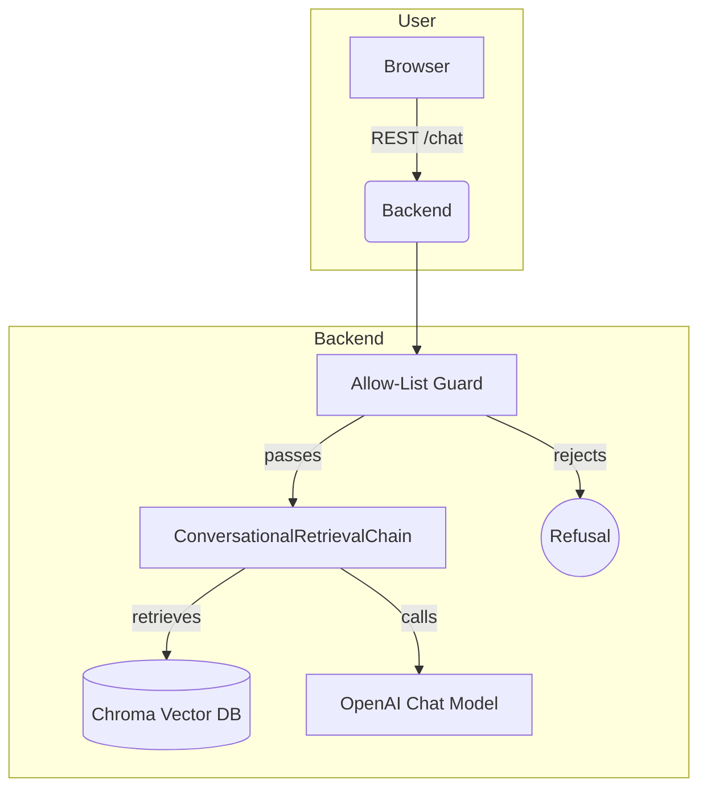

# Simple Chatbot

*A minimal Retrieval‑Augmented Generation (RAG) demo built with **LangChain**, **LangServe**, and **FastAPI**.  The project shows how to gate the assistant to a strict set of questions and answer them with up‑to‑date information gathered from the web.*

> **Why the name?**  The repo was designed as an interview exercise.  It ships with a pre‑configured knowledge base about the company **Promtior** so you can ask, for example, "What services does Promtior offer?". Swap the data set and the allow‑list and you get a brand‑new specialised bot.

---

## Table of Contents

1. [Features](#features)
2. [Architecture](#architecture)
3. [Project Layout](#project-layout)
4. [Prerequisites](#prerequisites)
5. [Running Locally](#running-locally)
6. [Running with Docker](#running-with-docker)
7. [Deploying on Railway](#deploying-on-railway)
8. [Customising the Bot](#customising-the-bot)
9. [License](#license)

---

## Features

| Capability               | Detail                                                                                                                                          |
| ------------------------ | ----------------------------------------------------------------------------------------------------------------------------------------------- |
| **RAG Pipeline**         | Web pages are scraped, chunked, embedded with OpenAI embeddings and stored in a local Chroma vector DB.                                         |
| **LangServe API**        | `POST /chat/invoke` returns streaming or JSON answers.  Mounted under FastAPI for easy extension.                                               |
| **Strict Allow‑List**    | A semantic similarity check (cosine > `threshold`) ensures the bot only answers whitelisted questions; everything else yields a polite refusal. |
| **Zero‑build Front‑end** | Vanilla HTML + CSS + JS placed in `ui/` and served by FastAPI – no framework or bundler required.                                               |
| **12‑Factor Ready**      | All secrets and tunables live in `.env` or `config.json`.  The container reads `PORT` so it Just Works™ on Railway and most PaaS providers.     |

---

## Architecture



1. **Ingestion** (`ingest.py`) pulls external pages plus any manual snippets, splits them, embeds them and persists a CHROMA collection in `api/db/`.
2. **Allow‑List Guard** computes the cosine similarity between the user’s question and pre‑embedded canonical phrasings.  If the best match is below the configured `threshold`, the request is short‑circuited.
3. **ConversationalRetrievalChain** adds the top‑k relevant chunks as context and queries the LLM.  LangServe wraps the chain and exposes `/chat/invoke`.

---

## Project Layout

```
.
├── api/                    ← Backend service (FastAPI + LangChain)
│   ├── Dockerfile          ← Container recipe – Railway autodetects it
│   ├── ingest.py           ← One‑off script to build/refresh the vector DB
│   ├── main.py             ← Starts LangServe, mounts the UI and guard‑rails
│   ├── config.json         ← All tunables (models, sources, allow‑list…)
│   ├── requirements.txt    ← Python deps
│   ├── db/                 ← Generated by `ingest.py` (git‑ignored)
├── └── .env.sample         ← Example of required env vars for the api side
├── ui/                     ← Static front‑end assets
│   ├── index.html          ← Plain chat UI
│   ├── style.css           ← Minimal styling
│   ├── app.js              ← Fetch wrapper + loading dots UX
│   └── config.json         ← Text labels that appear in the UI
├── .gitignore              ← Ignore secrets, vector DB, byte‑code…
└── LICENSE                 ← MIT
```

### Key Files Explained

| File                  | Why it matters                                                                                                                                                               |
| --------------------- | ---------------------------------------------------------------------------------------------------------------------------------------------------------------------------- |
| **`api/config.json`** | Single source of truth for *everything* in the API: crawl URLs, extra docs, allow‑list, model & retriever settings, FastAPI metadata.  Change it → restart the service → new behaviour. |
| **`ingest.py`**       | Run any time you tweak `source_urls` or want fresh content.  The output (`api/db/`) is a Chroma collection that will be memory‑mapped by `main.py`.                          |
| **`main.py`**         | Boots FastAPI, wires the guard class, attaches LangServe, and mounts `ui/` as static files at the root path.                                                                 |
| **`ui/app.js`**       | Very small: grabs labels from `/config.json`, handles the form submit, shows "typing…" dots, calls `/chat/invoke` and streams the answer.                                    |
| **`api/Dockerfile`**  | Sets `WORKDIR /app`, installs deps, copies source, exposes `$PORT`, and launches Uvicorn.  No separate image for the front‑end needed – FastAPI serves it.                   |

---

## Prerequisites

| Tool               | Minimum Version | Purpose                                     |
| ------------------ | --------------- | ------------------------------------------- |
| **Python**         |  3.11           | Backend runtime & ingestion script          |
| **Docker**         | 24.x            | *Optional* – convenient local container run |
| **OpenAI API Key** | n/a             | Needed at build/run time (`OPENAI_API_KEY`) |
| **uvicorn**        | latest          | Local testing                               |

---

## Running Locally

### 1 – Clone & enter the repo

```bash
git clone https://github.com/hrkns/simple-chatbot.git
cd simple-chatbot
```

### 2 – Create `.env`

```bash
cp api/.env.sample api/.env
# Then open api/.env and paste your real OPENAI_API_KEY
```

### 3 – Install Dependencies

```bash
pip install -r api/requirements.txt
```

### 4 – Build/Refresh the Vector DB

```bash
python api/ingest.py  # grabs pages, embeds, persists under api/db/
# When re-reunning this command during development and local testing, sometimes it's useful to remove any existing 'db' folder first
```

### 5 – Run the API

```bash
uvicorn api.main:app --host 0.0.0.0 --port 8000 --reload
```

Visit **[http://localhost:8000](http://localhost:8000)** – the chat UI loads and you can ask the whitelisted questions.

---

## Running with Docker

The `api/Dockerfile` contains everything (backend + UI):

```bash
# Build the image
docker build -t simple-chatbot ./api

# Ingest on a throw‑away container and copy the DB out
docker run --rm -e OPENAI_API_KEY=$OPENAI_API_KEY \
           -v $(pwd)/api/db:/app/db simple-chatbot python ingest.py

# Now run the full service
docker run -p 8000:8000 -e OPENAI_API_KEY=$OPENAI_API_KEY \
           -v $(pwd)/api/db:/app/db simple-chatbot
```

Open [http://localhost:8000](http://localhost:8000).

---

## Deploying on Railway

Railway will detect the Dockerfile automatically.

1. **Create project → "Deploy from GitHub" → pick this repo.**
2. **Environment Variables**: add `OPENAI_API_KEY` (and optionally `CONFIG_PATH`).
3. **First deploy** builds the image and boots FastAPI – but the vector store is empty.  Open the Railway "Shell" tab and run:

   ```bash
   python ingest.py
   ```

   This populates `/app/db`.  Restart the container and you’re done.
4. **(Optional) Persist the DB**
   *Option A* – Commit the generated `api/db/` folder (small, < 5 MB) so the next deploy has it baked in.
   *Option B* – Create a Railway volume and mount it at `/app/db` so you can update the content without rebuilding the image.

Your public URL will show the chat interface, e.g.

```
https://simple-chatbot-production.up.railway.app
```

---

## Customising the Bot

| Task                    | Where to Change                                                     | Then…                                                   |
| ----------------------- | ------------------------------------------------------------------- | ------------------------------------------------------- |
| Add/replace source docs | `api/config.json → source_urls` *or* add files to `extra_documents` | Re‑run `python ingest.py` and redeploy                  |
| Allow new questions     | Append canonical phrasing → `canonical_allowed`                     | Re‑run `python ingest.py` **(to embed the new prompt)** |
| Loosen / tighten guard  | Tweak `threshold` (0–1)                                             | No ingestion needed – restart backend                   |
| Change front‑end text   | `ui/config.json`                                                    | Static reload, recommended to make a hard reload in the browser for ignoring any possible stored cache                        |

---

## License

This project is released under the MIT License – see [LICENSE](LICENSE).

---

## Enjoy building!

Feel free to open issues or pull requests if you spot anything odd or have improvement ideas.
